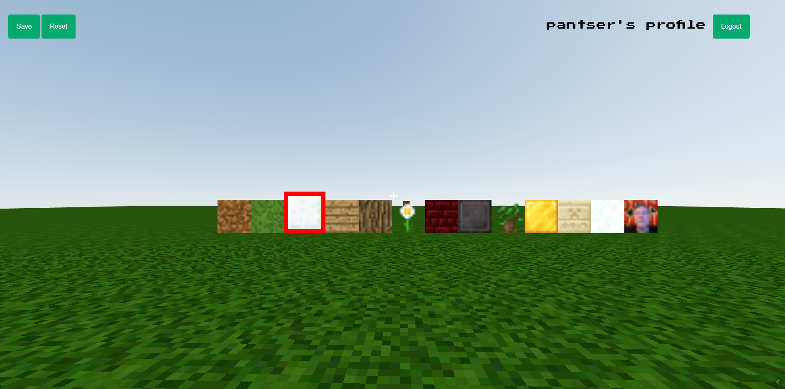

# Welcome to Pixel Block Party

This app is basically a minecraft clone built in react. The initial game build and mechanics were taken from a [youtube video](https://www.youtube.com/watch?v=qpOZup_3P_A) produced by [freeCodeCamp](https://www.freecodecamp.org/) and presented by [Daniel Bark](https://github.com/danba340).

Features were added to this app to allow for users to have their own world builds that do not depend on persisted localstorage.

[Link to Deployed App]()

